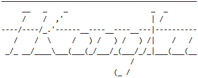
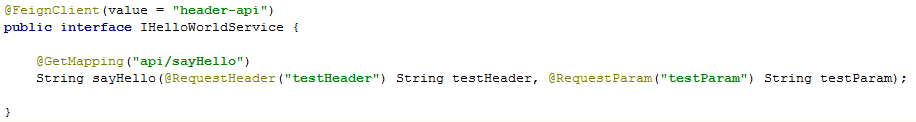
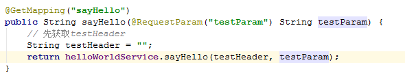
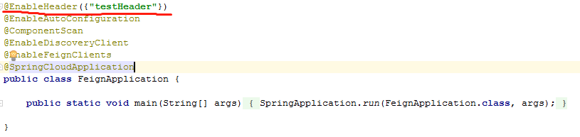
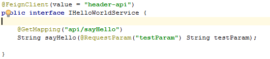

### 前景介绍

目前公司或者个人项目，基本都是前后端完全分离进行开发的，也尽量避免使用动态HTML语言来做成果项目，那么这样问题就来了，原始的方式是通过JavaEE和JSP来做，而涉及到的登录信息则选择用Session共享的方式进行，而现在使用分离的方式来做，显然Session共享已经不切实际了，而且大大限制了前端静态HTML的渲染效果，增加了太多的人力成本和资源成本。
而目前流行的方式则是Token认证的方式进行存储。
那么，现在就有人会问：
    我们公司项目小，只有一个服务，那么Token的传递就不是问题啊
    
    确实，对于单个服务而言，这种问题是不存在的，可以忽略。
    那么，我们受到了小项目的限制，而不去深思多服务吗，答案是肯定要去深思，只有这样，我们才能进步，切记，不要让环境限制了自己成长，人的成长是永无止境的。
    
而接下来，我们要讨论的事情就是微服务之间项目调用，而存在Token传递的问题。    
现在微服务之间项目调用我们可以采用Feign、Ribbon等方式进行调动，而这些开源服务，本身是不会帮你去封装Token的，所以，我们需要自己手动去重写里面的服务，把相应的头信息在服务之间进行传递

### 准备

如果文章中图片显示不了，请打开hosts文件，添加一下配置

```text
# GitHub Start 
192.30.253.112    github.com 
192.30.253.119    gist.github.com
151.101.184.133    assets-cdn.github.com
151.101.184.133    raw.githubusercontent.com
151.101.184.133    gist.githubusercontent.com
151.101.184.133    cloud.githubusercontent.com
151.101.184.133    camo.githubusercontent.com
151.101.184.133    avatars0.githubusercontent.com
151.101.184.133    avatars1.githubusercontent.com
151.101.184.133    avatars2.githubusercontent.com
151.101.184.133    avatars3.githubusercontent.com
151.101.184.133    avatars4.githubusercontent.com
151.101.184.133    avatars5.githubusercontent.com
151.101.184.133    avatars6.githubusercontent.com
151.101.184.133    avatars7.githubusercontent.com
151.101.184.133    avatars8.githubusercontent.com
# GitHub End
```

### 传统方式

> Feign调用方式

- Feign传统调用方式-死板




以上的方式，想想，假如我们一个程序中，需要大量使用调用外部接口，以上操作方式有多么庞大，多么冗余


### 新方式
项目暂时未入Maven仓库，需要自己下载下来编辑项目

执行以下命令，将包添加到本地Maven仓库中

`mvn.cmd install:install-file -Dfile=D:\github\spring-boot-starter-header\target\spring-boot-starter-header.jar -DgroupId=cn.ikangxu -DartifactId=spring-boot-starter-header -Dversion=1.0.0 -Dpackaging=jar`

引入以下依赖

```xml
    <dependency>
        <groupId>cn.ikangxu</groupId>
        <artifactId>spring-boot-starter-header</artifactId>
        <version>1.0.0</version>
    </dependency>
```

然后在启动类中添加注解`@EnableHeader({"testHeader1","testHeader2"})`



其中`testHeader1`、`testHeader2`是你想传递的头参数名称，头传递不限制个数



### HttpClient与HttpURLConnection调用方式

```yaml
cn:
  ikangxu:
    request:
      httpclient:
        charset: UTF-8
        connect-timeout: 5000
        connection-request-timeout: 5000
        socket-timeout: 15000
      net:
        charset: UTF-8
        do-output: true
        do-input: true
        use-caches: false
        connect-timeout: 5000
        read-timeout: 5000
```

以上是默认配置文件，如果需要变动上面的值，需要将以上配置添加到自己程序中的配置文件

调用方式，也是采用`@EnableHeader({"testHeader1","testHeader2"})`这样的注解方式

然后，程序中内置了两个模板，一个`HttpClientTemplate`、一个`HttpURLTemplate`

> HttpClientTemplate

```java
    @Autowired
    private HttpClientTemplate httpClientTemplate;
    
    @GetMapping("sayHelloHttpClient")
    public String sayHelloHttpClient() {
        Map<String, String> params = new HashMap<>();
        params.put("testParam", "httpClientTemplate");
        return httpClientTemplate.getEntity("http://localhost:4201/api/sayHello", params);
    }
```

> HttpURLTemplate

```java
    @Autowired
    private HttpURLTemplate httpURLTemplate;
	
    @GetMapping("sayHelloHttpURL")
    public String sayHelloHttpURL() {
        Map<String, Object> params = new HashMap<>();
        params.put("testParam", "222");
        return httpURLTemplate.getEntity("http://localhost:4201/api/sayHello", params);
    }
```

以上简单的方式就可以实现外部链接的调用

### 完成计划

| 支持 | 完成情况 | 测试情况 |
| :------| :------ | :------ |
| Feign | 已完成 | 已通过 |
| Ribbon | 已完成 | 已通过 |
| HttpClient | 已完成 | 已通过 |
| HttpURLConnection | 已完成 | 已通过 |


### 测试情况

请参考测试 [DEMO](https://github.com/IKangXu/ikx-demo/tree/master/header)